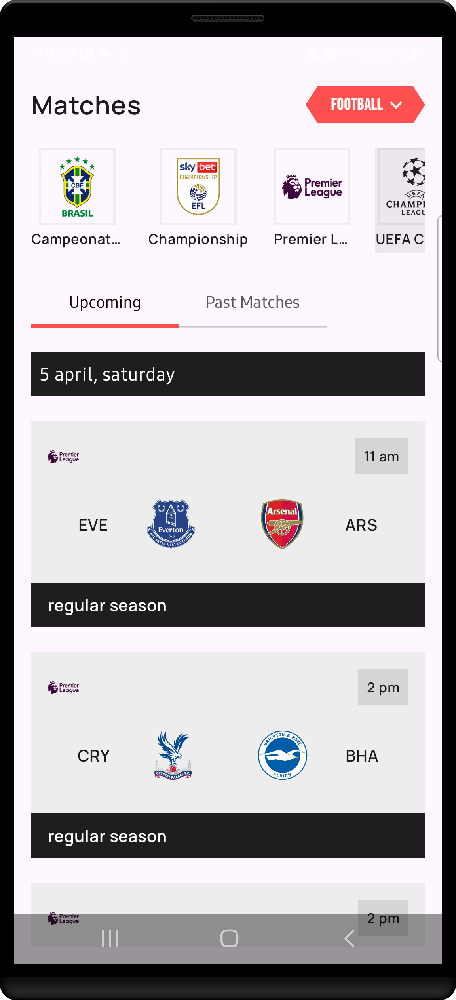
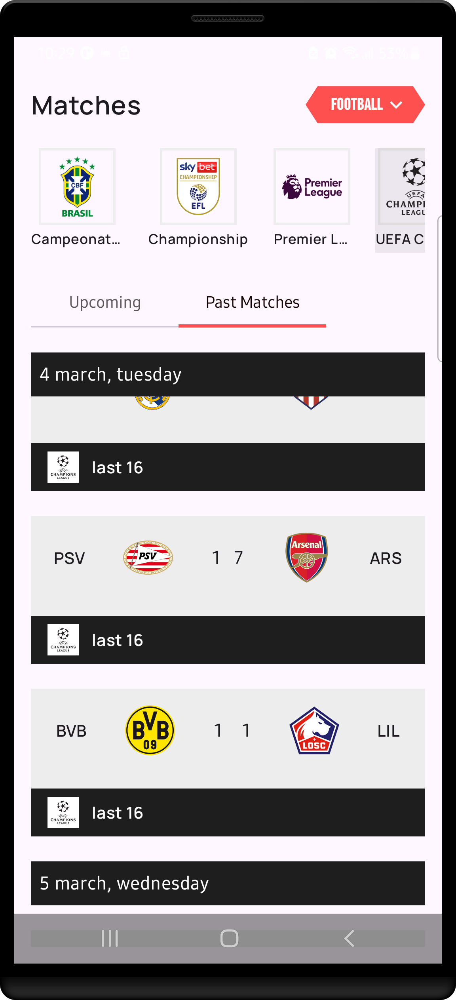

# Sportify - Football Matches Tracker  

## Overview  
A minimalist Android app showcasing upcoming football matches using:  
- **Kotlin**  
- **Jetpack Compose**  
- **Ktor Client**  
- **Koin (DI)**
- **Clean Architecture**
- **MVVM**


---

## Screenshots

  


---

## Project Structure  

```  
.
├── core
│   ├── data
│   │   └── networking           # Shared API clients/interceptors  
│   │       └── util            # Network utilities  
│   ├── domain                  # Shared use cases/models  
│   └── presentation
│       └── theme               # App-wide theming  
│           └── ui              # Base UI components  
├── di                          # Koin dependency modules  
└── match_list_screen           # Feature module  
    ├── data
    │   ├── local               # (Optional future persistence)  
    │   └── networking          # Match-specific API services  
    ├── domain
    │   ├── entities            # Match data models  
    │   └── mappers            # Data transformation  
    └── presentation
        └── components          # Composable UI for matches  
```
---
## Tech Stack  

| Layer          | Technology       |  
|----------------|------------------|  
| **UI**        | Jetpack Compose  |  
| **Networking**| Ktor Client      |  
| **DI**       | Koin             |  
| **Async**    | Coroutines Flow  |  
